

  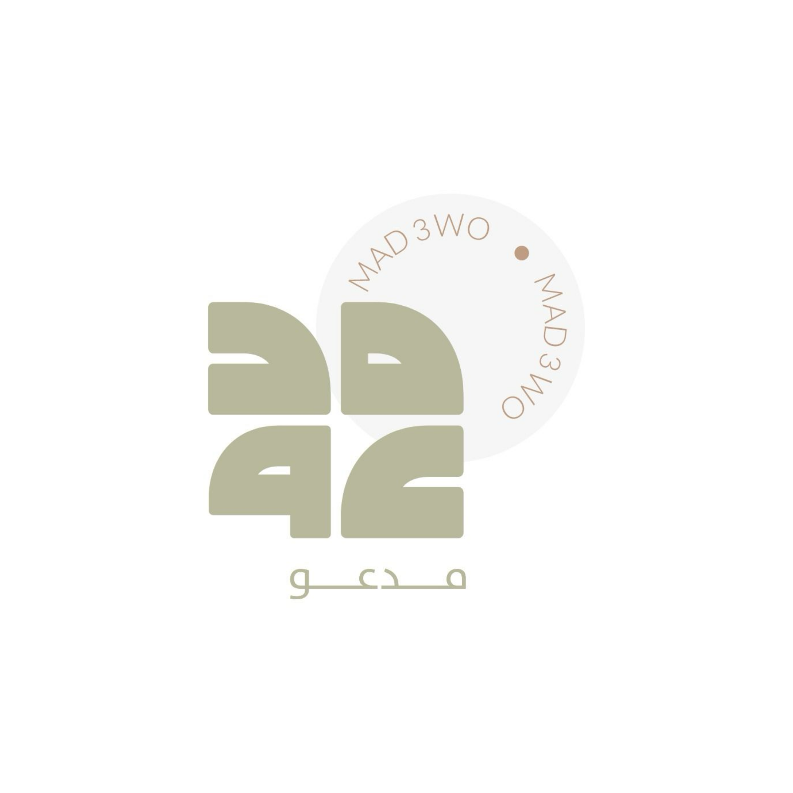
  <h1>مدعو · Madow</h1>
  
<strong>An Arabic-first event invitation experience</strong>

  
Explore the app, browse invitation designs, and follow the invite creation journey.

  

    <a href="https://husseinabozina.github.io/madow-view/">Open the live portfolio</a>
    ·
    <a href="#screenshots">App screenshots</a>
    ·
    <a href="#invitation-designs">Invitation designs</a>
  

  

    
    
    
    
  

---

## About the project

**Madow (مدعو)** is a mobile app concept for creating and sharing invitations for meaningful occasions. It brings the main choices into one guided experience: choose an occasion, find a design, review a package, and add the event details.

This repository contains the **public portfolio website and project presentation**. The Flutter application is maintained separately. The portfolio is published with GitHub Pages and includes real app screens and invitation artwork.

> **Project status:** This is a presentation/demo project. The screens and invitation designs shown here describe the current app experience; online services, payment processing, and backend behavior are not represented as production features.

## What I built

- Shaped a clear, multi-step invitation flow from occasion selection through package and template selection.
- Created an Arabic-first interface with right-to-left layout and Arabic typography.
- Designed and organized invitation examples for weddings, graduations, birthdays, and newborn celebrations.
- Added dedicated app screens for the home page, occasion categories, template gallery, package selection, template preview, and order history.
- Built a responsive portfolio page to present the app journey and artwork on desktop and mobile.

## Product highlights

| Area | What it offers |
| --- | --- |
| Occasion discovery | Browse wedding, graduation, birthday, and newborn invitation categories. |
| Template gallery | Explore invitation designs and preview the selected template. |
| Guided creation | Move through package, occasion, and template choices before entering invitation details. |
| Arabic RTL | A right-to-left interface designed around Arabic content. |
| Home experience | Promotional slider, featured invitation templates, and category entry points. |
| Order history | A dedicated screen for reviewing invitation requests in the demo experience. |

## Store-style app screenshots

Six polished portrait visuals prepared at **1080 × 1920 px (9:16)**. Each pairs an unchanged app screenshot with a consistent Madow frame, colors, and a short Arabic headline. Select an image to open the full-resolution file.

  <table>
    <tr>
      <td align="center"><a href="assets/google-play/01-home.jpg">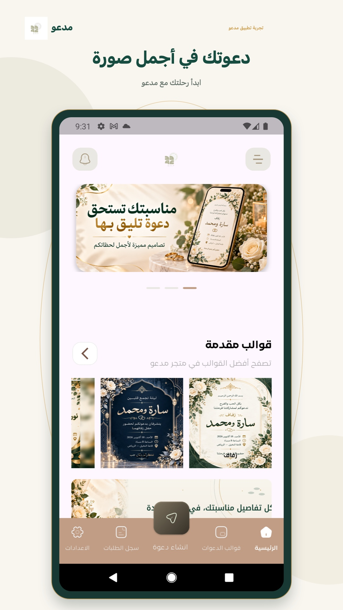</a> <strong>دعوتك في أجمل صورة</strong> Home</td>
      <td align="center"><a href="assets/google-play/02-occasions.jpg">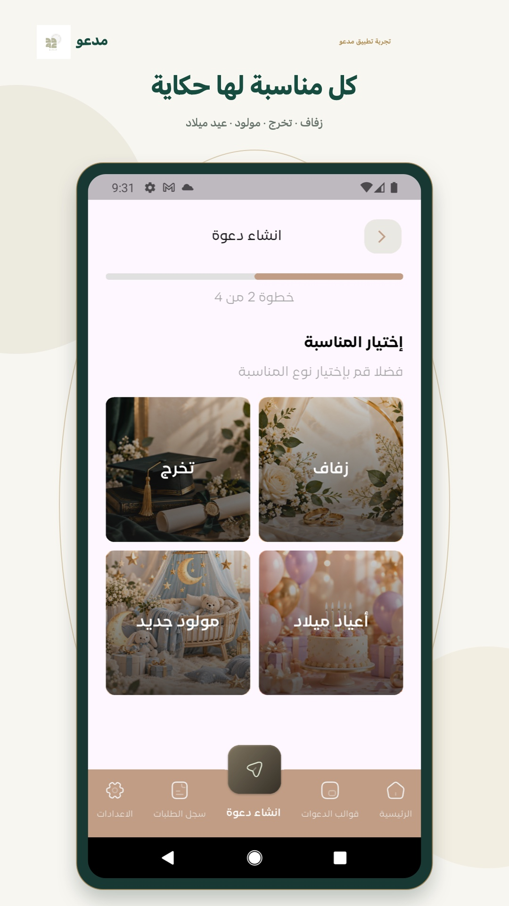</a> <strong>كل مناسبة لها حكاية</strong> Choose an occasion</td>
      <td align="center"><a href="assets/google-play/03-templates.jpg">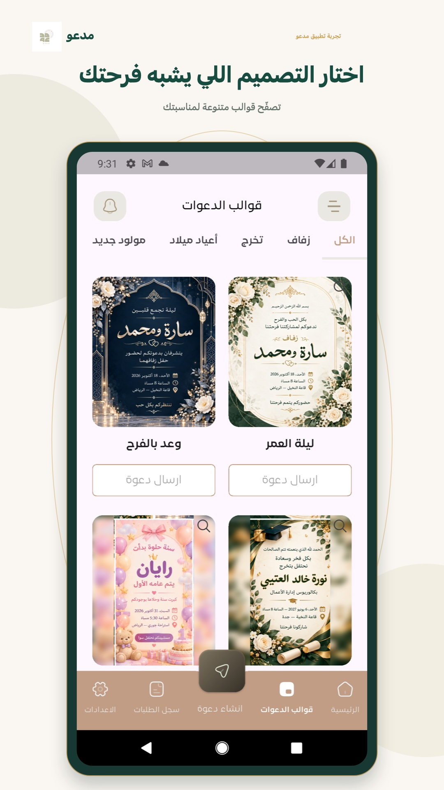</a> <strong>اختار التصميم اللي يشبه فرحتك</strong> Browse templates</td>
    </tr>
    <tr>
      <td align="center"><a href="assets/google-play/04-preview.jpg">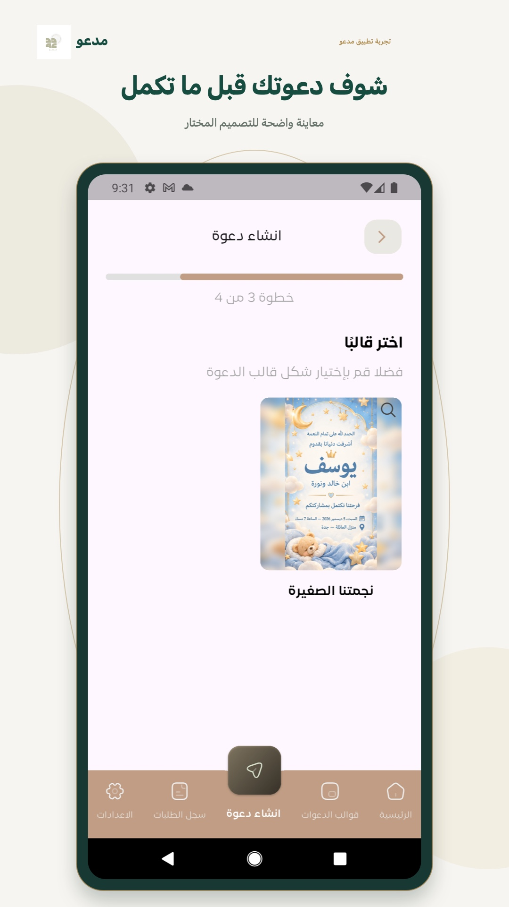</a> <strong>شوف دعوتك قبل ما تكمل</strong> Preview a design</td>
      <td align="center"><a href="assets/google-play/05-packages.jpg">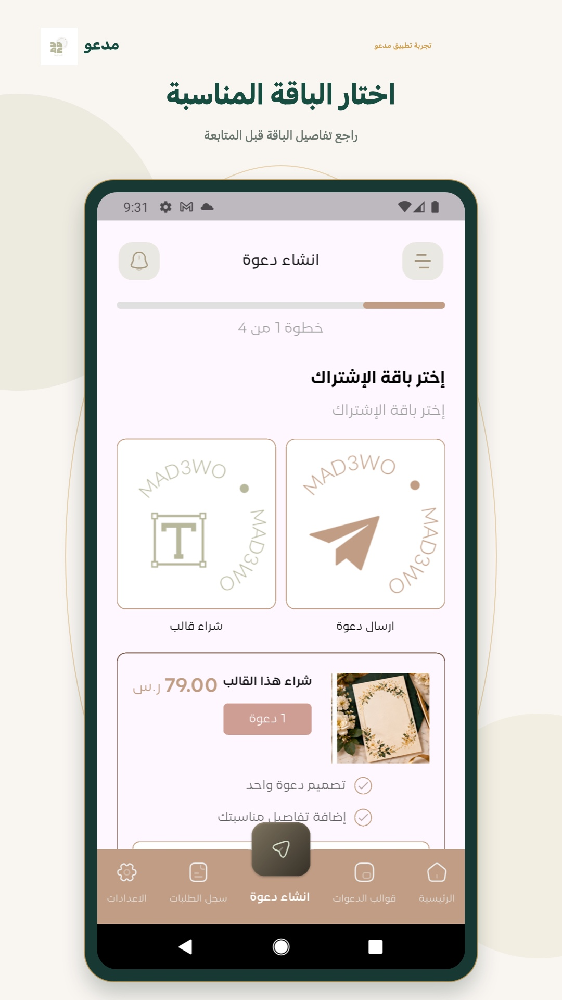</a> <strong>اختار الباقة المناسبة</strong> Choose a package</td>
      <td align="center"><a href="assets/google-play/06-orders.jpg">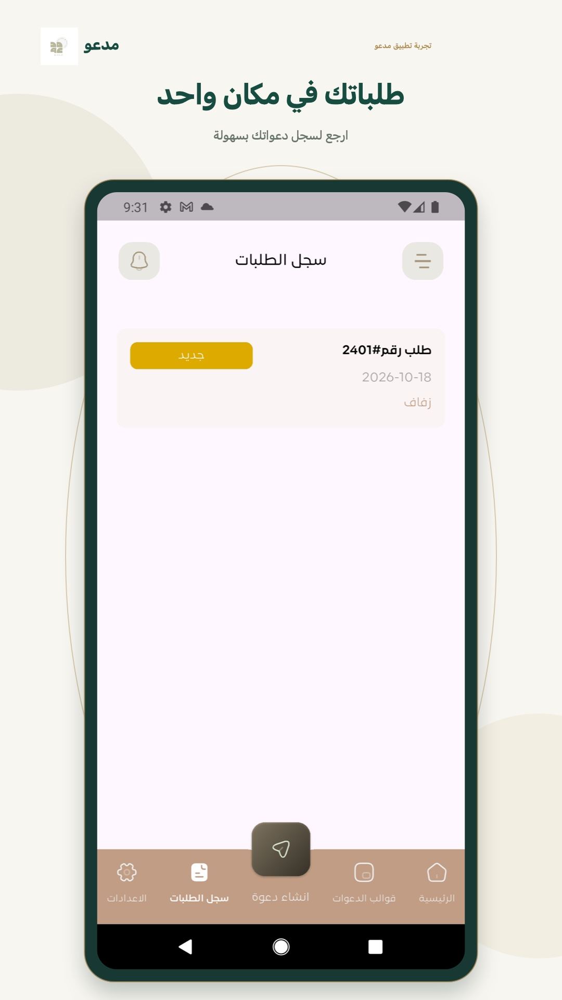</a> <strong>طلباتك في مكان واحد</strong> Order history</td>
    </tr>
  </table>

The unframed source captures are available in [`assets/screenshots/`](assets/screenshots/) as well.

## Invitation designs

  <table>
    <tr>
      <td align="center">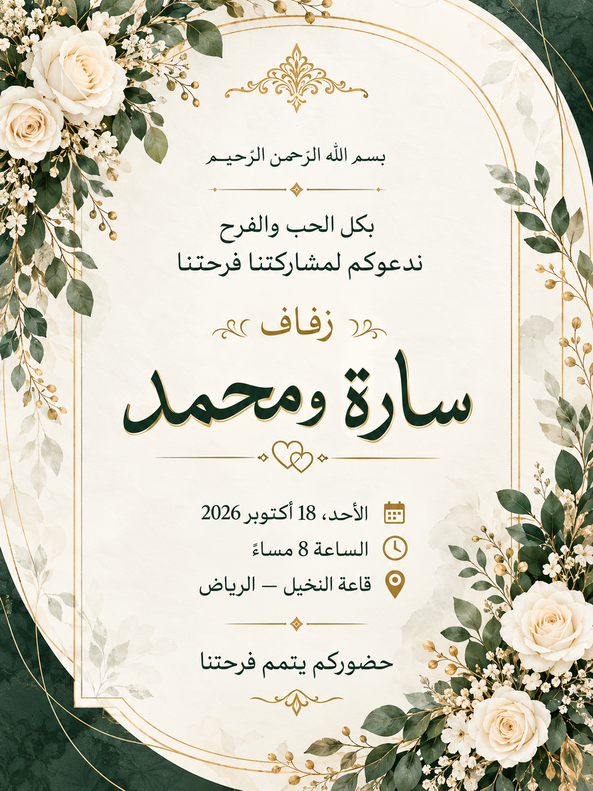 <strong>ليلة العمر</strong> Wedding</td>
      <td align="center">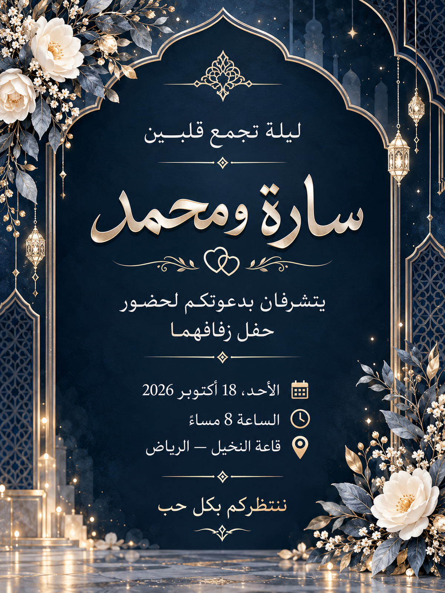 <strong>وعد بالفرح</strong> Wedding</td>
      <td align="center">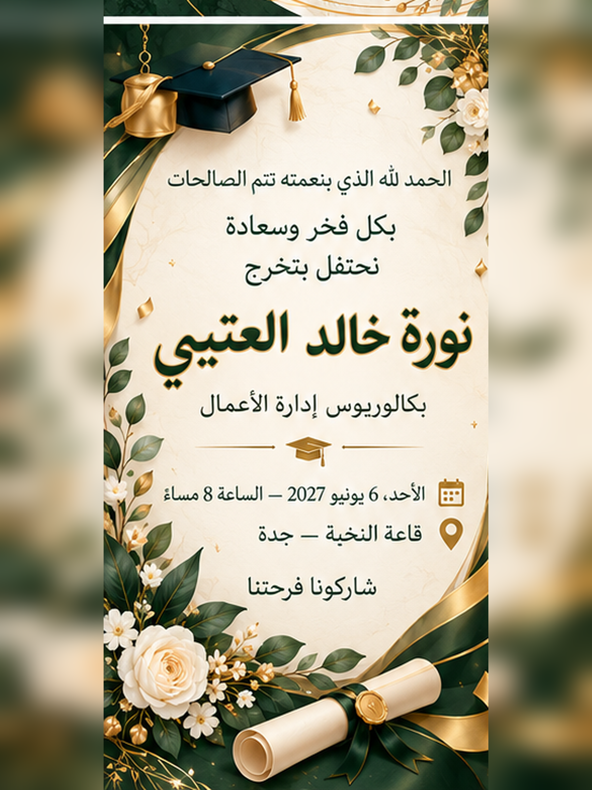 <strong>بداية مشرقة</strong> Graduation</td>
      <td align="center">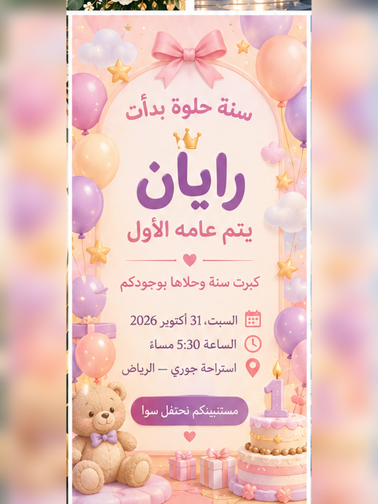 <strong>عام من السعادة</strong> Birthday</td>
      <td align="center">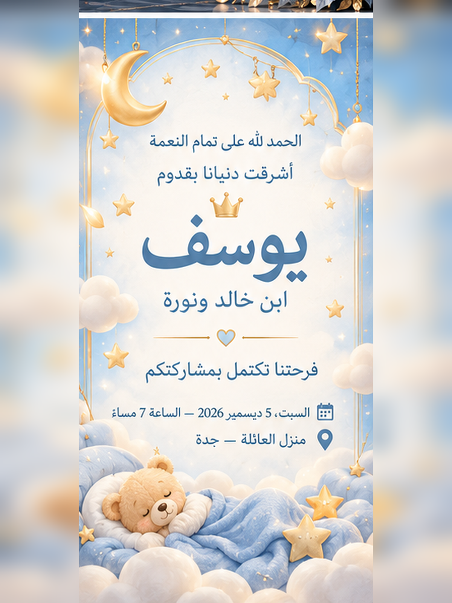 <strong>نجمتنا الصغيرة</strong> Newborn</td>
    </tr>
  </table>

## Tech and delivery

- **Mobile app:** Flutter · Dart
- **Portfolio:** HTML · CSS · JavaScript
- **Hosting:** GitHub Pages
- **Localization and layout:** Arabic · RTL

## Try the portfolio

Visit the [live Madow portfolio](https://husseinabozina.github.io/madow-view/) to explore the app screens and invitation designs.

An installable Android APK will be linked from the portfolio when a shareable build is added. No APK is included in this repository yet.

## العربية

**مدعو** تجربة تطبيق عربية لإنشاء دعوات المناسبات. يمر المستخدم باختيار المناسبة، ثم الباقة والقالب، وبعدها تفاصيل الدعوة.

يتضمن المشروع واجهة عربية من اليمين إلى اليسار، وأقسامًا للزفاف والتخرج وأعياد الميلاد والمولود الجديد، ومعرضًا للقوالب، وشاشات لاختيار الباقة ومعاينة التصميم وسجل الطلبات. يحتوي هذا المستودع على موقع العرض العام؛ أما تطبيق Flutter فيُدار بشكل منفصل.

> **حالة المشروع:** نسخة للعرض وتقديم تجربة التطبيق والتصاميم. لا يدّعي هذا المستودع وجود خدمات خلفية أو دفع إلكتروني جاهز للإنتاج. ملف APK سيُضاف إلى صفحة العرض عند توفر نسخة مشاركة.

  Made with care for life's celebrations · صُمّم لكل فرحة حكاية

